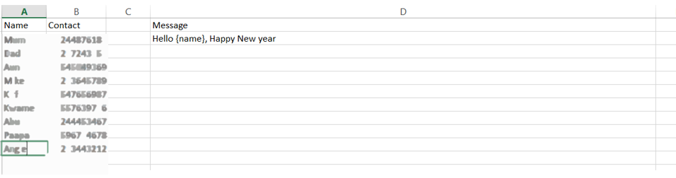
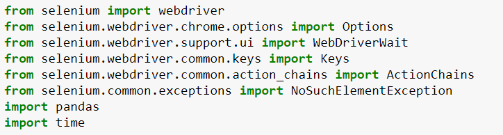
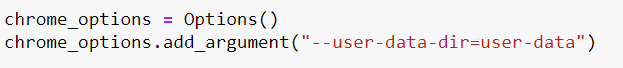

# Python Automated WhatsApp Messages Sender

This script sends WhatsApp messages automatically from WhatsApp web application to contacts. The name of the contact, their phone number and the message you want to send to all of them at once are saved in an excel file.
* The user scans web QR code to log in into the WhatsApp web application.
* The script reads a message from an excel sheet.
* The script reads each row and then searches for the contact number in the search box. 
* If the number is found on WhatsApp, it will send a customized message to them otherwise it will read the next row.

## Tools Used
* Python 3.8
* Selenium Web Driver
* Google Chrome
* Pandas
* Xlrd
* Selenium<br>

You will also need an excel file that contains 3 columns- the name of your contact, their phone number and the message we want to send to all of them<br>



## SetUp
* Clone this repo
* Create an environment using :
  ```
  conda create -n "env name" python=3.8
  
  ```
  
* Activate the environment using:

  ```
  conda activate "env name"
  ```
  
* Install Packages using:
  
  ```
  pip install -r requirements.txt 
  
  ```

## Approach
* Import Packages<br>

* Store our session details so that we do not have to be logging in to WhatsApp web every time<br>


* The script reads rows one by one and searches that contact number in the web search box if the contact number found on WhatsApp then it will send a configured message otherwise It reads next row. 
* Loop execute until and unless all rows complete.


https://medium.com/@insecurecoders/how-to-automate-whatsapp-to-send-personalized-messages-to-100-contacts-using-python-e7cac37dd7


http://labs.brotherli.ch/vcfconvert/
